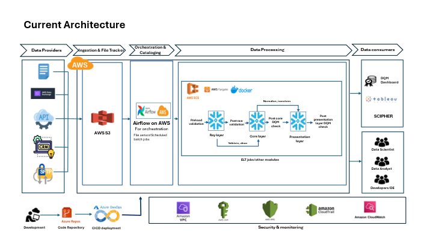

# 3. Our Data Pipeline: The Big Picture 🗺️

## Overview

Think of our **data pipeline** as a **sophisticated factory**.

*Figure 1: High-level Architecture Diagram of EVERSANA's Data Pipeline*

- **Raw materials = Data**  
- **Finished products = Business insights**

This factory doesn't just move data from point A to point B. It **cleans, enriches, transforms, and delivers** data so that it becomes useful for analytics, reporting, and decision-making.

---

## Why Does It Matter?

At EVERSANA, **data drives decisions**.  
Our pipeline ensures that:

- **Right data** reaches the **right people**  
- Data is **accurate**, **secure**, and **on time**  
- We have **full visibility** into the data lifecycle

---

## The Pipeline Stages

Our pipeline is divided into **several logical stages**, each playing a unique role:

### 1️⃣ **Data Sources: Where Data Begins 📥**

- This is where all **raw data originates**  
- Could be from **CRM systems**, **external vendors**, **APIs**, or **manual uploads**

[Learn More → Data Sources](./data_sources.md)

---

### 2️⃣ **Ingestion & File Tracking: Getting Data In 📦**

- Incoming data is stored in **AWS S3 Buckets**  
- Every file is **automatically tracked** (file name, arrival time, size, etc.) in **Snowflake metadata tables**  
- This allows **monitoring and auditing**

[Learn More → Ingestion & File Tracking](./ingestion_file_tracking.md)

---

### 3️⃣ **Orchestration: The Master Scheduler ⏰**

- We use **Apache Airflow** to control the **sequence** and **timing** of processing steps  
- Airflow uses **DAGs** (Directed Acyclic Graphs) to define workflows  
- Workflows can be triggered **by time** or **when new data arrives**

[Learn More → Orchestration](./orchestration.md)

---

### 4️⃣ **Data Processing: Turning Raw into Ready ⚙️**

- Data is **cleaned, transformed, enriched, and standardized**  
- We process data across **different layers**:

| Layer             | Purpose                                   |
|------------------|-------------------------------------------|
| **Landing Layer** | Stores raw files exactly as received      |
| **Raw Layer**     | Initial formatting (e.g., column parsing) |
| **Core Layer**    | Main transformations and enrichment       |
| **Presentation Layer** | Final data products for reporting   |

[Learn More → Data Processing](./data_processing.md)

---

### 5️⃣ **Data Consumers: Using the Data 📈**

- **Business analysts**, **data scientists**, and **applications** use the processed data  
- Tools like **Tableau** and **Power BI** connect directly to the **Presentation Layer in Snowflake**  
- Enables **dashboards, models, and insights**

[Learn More → Data Consumers](./data_consumers.md)

---

